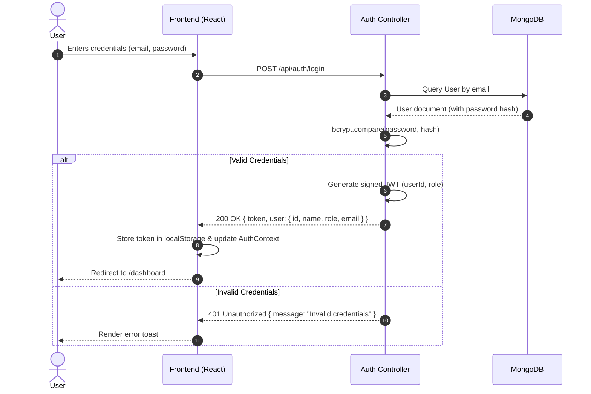
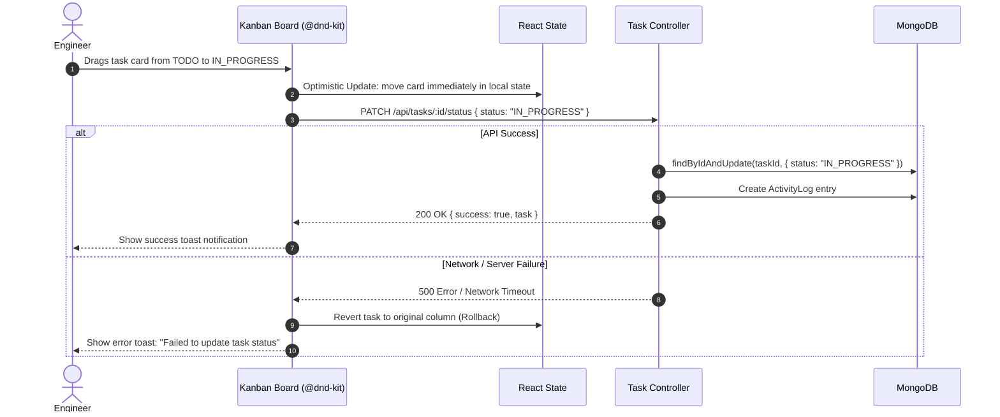
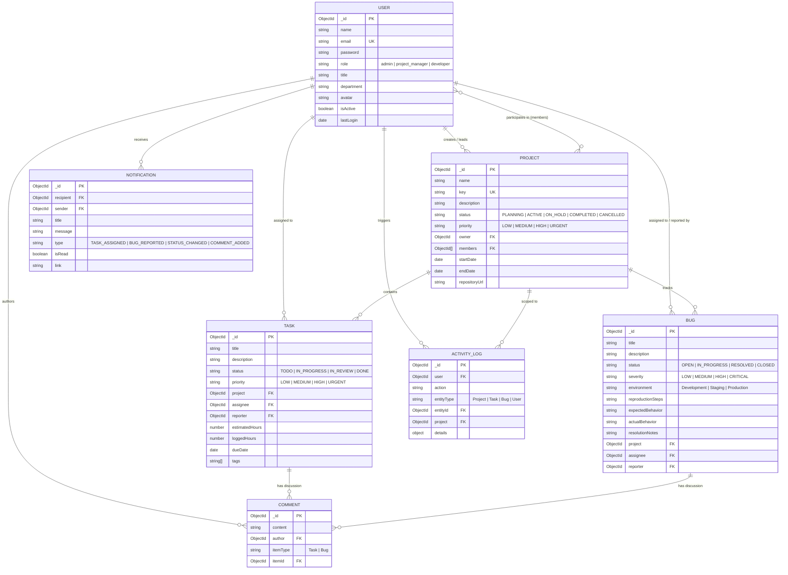

# DevTrack Architecture & Design Specification

## 1. System Overview & Context

DevTrack is architected as a modern decoupled full-stack platform following the client-server REST paradigm. The frontend is a responsive Single Page Application (SPA) built with React and Vite, while the backend is an event-driven Node.js/Express REST API communicating with a MongoDB document database.

```mermaid
graph TD
    User["User / Web Browser"]
    
    subgraph Frontend ["DevTrack Frontend (React + Vite)"]
        UI["UI Layer (Tailwind CSS, Lucide, Recharts)"]
        State["State Layer (Auth, Theme, Notification Contexts)"]
        DnD["Kanban Engine (@dnd-kit)"]
        APIClient["API Client (Axios Interceptors)"]
        UI --> State
        UI --> DnD
        State --> APIClient
        DnD --> APIClient
    end

    subgraph Backend ["DevTrack Backend (Node.js + Express)"]
        Gate["Security & Middleware (Helmet, CORS, RateLimit)"]
        Router["Express Router & Route Guards"]
        Validators["Input Validation (express-validator)"]
        Controllers["Controller Layer"]
        Services["Domain Services (Audit, Notification)"]
        Mongoose["Mongoose ODM (Models, Hooks, Indexes)"]
        
        Gate --> Router
        Router --> Validators
        Validators --> Controllers
        Controllers --> Services
        Controllers --> Mongoose
        Services --> Mongoose
    end

    subgraph Storage ["Persistence Layer"]
        DB[("MongoDB / In-Memory MongoDB")]
        Mongoose --> DB
    end

    User -->|HTTPS Requests| UI
    APIClient -->|REST API (JSON / Bearer Token)| Gate
```

---

## 2. Component & Container Architecture

### 2.1 Frontend Architecture (`frontend/src`)
```
frontend/src/
├── components/
│   ├── common/         # Core atomic UI design system (Button, Input, Card, Modal, Badge, etc.)
│   ├── kanban/         # Drag-and-drop board components (KanbanColumn, KanbanCard)
│   ├── tasks/          # Task management forms, filters, and modals
│   ├── bugs/           # Defect management modals and triage forms
│   ├── projects/       # Project creation and member roster modals
│   ├── comments/       # Unified comment thread components
│   └── layout/         # AppLayout, Navbar, Sidebar, Footer, PublicNavbar
├── context/            # React context providers (AuthContext, ThemeContext, ToastContext, etc.)
├── pages/              # Routed page views (Dashboard, Kanban, Tasks, Bugs, Team, Admin, etc.)
├── routes/             # AppRoutes, ProtectedRoute guard, RoleRoute RBAC guard
├── services/           # Typed Axios API clients (authService, taskService, bugService, etc.)
└── utils/              # Pure utility functions (date formatters, metric calculators)
```

### 2.2 Backend Architecture (`backend/src`)
```
backend/src/
├── config/             # Environment variables and resilient DB connection loader
├── controllers/        # Request orchestration, status codes, and HTTP responses
├── middleware/         # auth (JWT), role (RBAC), error (central handler), validate
├── models/             # Mongoose schemas with compound indexes, hooks, and virtuals
├── routes/             # Versioned REST endpoints with route-level middleware
├── seeds/              # Comprehensive database seeder with realistic engineering data
├── services/           # Business logic: activityService (audit stream), notificationService
└── validators/         # Declarative request validation rules
```

---

## 3. Data Flow & Sequence Diagrams

### 3.1 Authentication & Authorization Flow


### 3.2 Optimistic Kanban Drag-and-Drop Workflow


---

## 4. Entity Relationship (ER) Diagram



---

## 5. Security & Defensive Engineering

1. **Defense-in-Depth Middleware Stack:**
   - **`helmet`**: Enforces strict Content Security Policy, X-XSS-Protection, and Frameguard to prevent clickjacking and injection.
   - **`cors`**: Whitelists configured frontend origins (`CORS_ORIGIN`).
   - **`express-rate-limit`**: Restricts excessive client bursts to throttle brute-force attacks.
2. **Stateless JWT Verification:**
   - Cryptographically signs payloads using `HMAC SHA-256` with strong secret keys.
   - Verified on every protected route via `authenticate` middleware.
3. **Role-Based Access Control (RBAC):**
   - Express middleware `authorize(...roles)` gates administrative and managerial endpoints.
   - Unauthorized attempts yield `403 Forbidden` with standardized error schemas.
4. **Input Sanitization & Validation:**
   - All inbound payloads are validated using `express-validator` chains before reaching business controllers.
   - MongoDB queries rely exclusively on strongly-typed Mongoose models to prevent NoSQL query operator injection.
5. **Safe In-Memory Fallback:**
   - The connection manager attempts a connection to `MONGODB_URI`. If unavailable, it transparently spawns an in-memory `MongoMemoryServer` without leaking credentials or halting execution.
