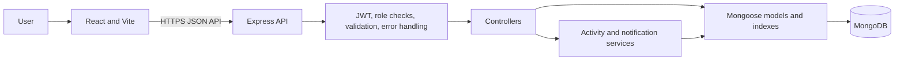
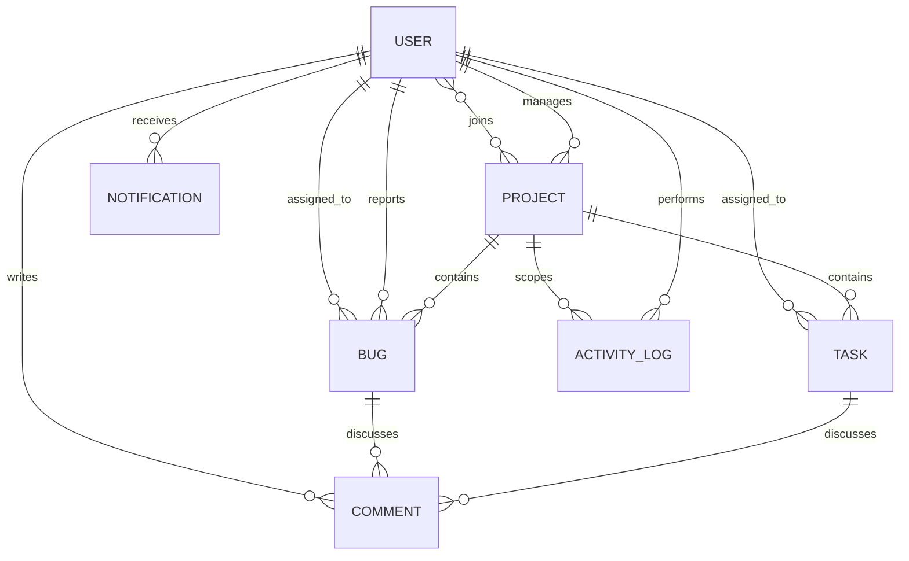

# DevTrack Architecture

## System overview

DevTrack is a client-server application. The React/Vite single-page frontend calls a JSON REST API served by Express. Mongoose stores application data in MongoDB; connection failures stop startup rather than switching to a transient store.

## Application boundaries

### Frontend

`frontend/src` contains routed pages, shared and domain-specific components, React context providers, Axios services, and small utility modules. Protected routes improve the user experience, but the backend independently enforces authentication, role requirements, and project membership. The Kanban board persists status changes through the task API and restores its prior state when an update fails.

### Backend

`backend/src` separates Express route definitions, middleware, request validators, controllers, Mongoose models, and services. Routes apply authentication and role restrictions; controllers apply project scope to item access; schema validation and indexes protect persisted records. The centralized error middleware returns validation details without echoing submitted secrets and avoids exposing internal errors in production.

## Authentication and authorization

Passwords are hashed with bcrypt before storage. Login issues a signed JWT; the frontend keeps the token in browser storage and includes it on API requests. Public registration always assigns the developer role; privileged roles must be granted by an administrator. Production startup requires an explicit MongoDB URI, 32-character-or-longer JWT secret, and allowed client origin(s). Password reset is unavailable in production until an email delivery flow is configured.

Project managers and administrators retain the broader access provided by the existing application roles. Developers can access project work only when listed as a project member or manager; this scope is applied to task, bug, and comment reads and writes.

## Persistence and startup

MongoDB is the sole durable production store. The application does not fall back to in-memory MongoDB when its configured database is unavailable. Development startup may reconcile the additive demo catalog. Production startup never seeds demo users.

Local JSON snapshots are disabled unless `ENABLE_LOCAL_SNAPSHOTS=true` is explicitly configured in development. A snapshot can contain personal data and password hashes; protect it as sensitive data and do not use it as a production backup. Restore refuses to overwrite a MongoDB database that already has records. See [database.md](./database.md) for collections, indexes, and relationship semantics.

## Entity relationships

Comments use a polymorphic `(entityType, entityId)` pair. MongoDB does not enforce foreign keys, so item and project removal explicitly cleans related work records, comments, and project activity logs. Removing a user is rejected while they manage projects; otherwise project memberships and task/bug assignments are cleared and their notifications are cleaned up.

## Deployment topology

Deploy the backend as a Node.js service connected to a managed MongoDB deployment, and deploy the built `frontend/dist` assets to a static host or compatible web server. Configure `CLIENT_URL` with the exact browser origin(s), enable HTTPS at the hosting edge, and supply production secrets through the deployment platform's secret manager. See the repository [README](../README.md) for setup and deployment steps.
